# Green Spaces Memory Map — Build Plan & DEV.to Post Draft

---

## Weekend Sprint Plan

Deadline: **Sunday April 19, 11:59 PM PDT**

```mermaid
gantt
    title Green Spaces — Weekend Build Schedule
    dateFormat  HH:mm
    axisFormat  %H:%M

    section Friday Night
    Firebase project setup         :done, f1, 19:00, 30m
    Vite + React scaffold          :done, f2, after f1, 30m
    Map rendering + basic pin      :f3, after f2, 1h
    Data model + Firestore helpers :f4, after f3, 45m

    section Saturday Morning
    Add Memory modal (form)        :s1, 09:00, 1h
    Click-to-pin on map            :s2, after s1, 45m
    Firebase Storage image upload  :s3, after s2, 45m
    Real-time onSnapshot hook      :s4, after s3, 30m

    section Saturday Afternoon
    Sidebar + filter bar           :s5, 13:00, 1h
    Memory detail overlay          :s6, after s5, 45m
    Seed data + CSS styling pass   :s7, after s6, 1h30m

    section Sunday
    Bug fixes + polish             :su1, 10:00, 1h
    Add 2 more seed pins (global)  :su2, after su1, 30m
    Deploy to Firebase Hosting     :su3, after su2, 30m
    Record Loom demo               :su4, after su3, 30m
    Write + publish DEV.to post    :su5, after su4, 1h30m
```



---

## Task Checklist

### Firebase Setup
- [ ] Create Firebase project (no Analytics)
- [ ] Add Web App → copy config
- [ ] Enable Firestore → test mode → paste rules
- [ ] Enable Storage → test mode → paste rules
- [ ] (Later) Enable Hosting

### Scaffold
- [ ] `npm create vite@latest green-spaces -- --template react`
- [ ] Install: `firebase`, `react-leaflet`, `leaflet`, `uuid`
- [ ] Create file structure (`lib/`, `hooks/`, `components/`)

### Core Features
- [ ] Map renders with OSM tiles
- [ ] Custom SVG pin icons per type
- [ ] Click map → open AddMemoryModal with lat/lng
- [ ] Form: title, location, date, author, story, type, image
- [ ] Image upload to Firebase Storage
- [ ] Save memory to Firestore
- [ ] Real-time `onSnapshot` updates map live
- [ ] Sidebar list + filter bar
- [ ] Memory detail overlay
- [ ] Seed data (6 pins)

### Polish
- [ ] Loading state on map
- [ ] Form validation (title + story required)
- [ ] Saving state on submit button
- [ ] Empty state in sidebar
- [ ] Responsive enough for demo (desktop priority)
- [ ] Earthy CSS aesthetic applied throughout

### Launch
- [ ] `npm run build` succeeds with no errors
- [ ] Deployed + public URL working
- [ ] Loom or GIF demo recorded
- [ ] GitHub repo public with clean README

---

## DEV.to Post Draft

```
---
title: I Built a Green Spaces Memory Map for Earth Day 🌿
published: true
tags: devchallenge, weekendchallenge, react, firebase
---

*This is a submission for [Weekend Challenge: Earth Day Edition](https://dev.to/challenges/weekend-2026-04-16)*

---

## What I Built

**Green Spaces** is a community memory map for the places that made you love the planet.

Click anywhere on the map, drop a pin, and leave a short story about a trail, summit, park,
beach, or urban green space that means something to you. Every pin is someone's real moment
in a real place. The map is shared — when you add yours, everyone sees it in real time.

I built this because I'm a marathon runner and backpacker, and the places I run and hike
are the reason I care about the environment at all. Earth Day data is everywhere. What's
harder to find is the *feeling* behind it. This app is about that.

---

## Demo

[EMBED DEPLOYED LINK OR LOOM VIDEO HERE]

---

## Code

[EMBED GITHUB REPO HERE]

---

## How I Built It

### Stack
- **React + Vite** — fast dev setup, familiar territory
- **React-Leaflet** — open-source map rendering, no API key required
- **Firebase Firestore** — real-time database; new pins appear for everyone instantly
- **Firebase Storage** — image uploads, served from CDN
- **GitHub Copilot** — pair-programmed the whole thing with Copilot active throughout

### The Map
React-Leaflet made map rendering surprisingly painless. The trickiest part was custom pin icons
— Leaflet's default markers break with Vite's bundler because of how it resolves asset URLs.
The fix: switch to inline SVG via `L.divIcon`. This also turned out to be better design-wise,
since I could colour-code each pin by place type and embed an emoji right in the SVG.

### Real-time Sync
Firestore's `onSnapshot` keeps a live WebSocket connection open. New pins from any user appear
on the map without a page refresh. The hook merges live Firestore documents with local seed data,
so the map is always populated even on a fresh Firebase project.

### Image Uploads
Firebase Storage handles image uploads cleanly. The flow: user picks a file → upload to
`memories/{uuid}.ext` → get the download URL → save URL in the Firestore document alongside
the pin data. Storage rules limit uploads to images under 5MB.

### Seed Data
Six memories from real places I've been — Banff, Vancouver's Pacific Spirit park, the Lake
District, Tofino, the Rideau Canal in Ottawa, and Hampstead Heath in London. Seeding the
map client-side (rather than writing to Firestore) means you can clone the repo and see a
populated map instantly, without any database setup.

### Design
I wanted it to feel like a naturalist's field journal rather than a tech dashboard. Warm
forest tones, aged parchment backgrounds, Playfair Display for headings, Lora for body text.
The map tiles are plain OpenStreetMap — earthy and detailed without the glossiness of Google Maps.

---

## What I'd Add Next

- Pin clustering at low zoom levels (the map gets noisy at world scale)
- Auth so people can manage their own memories
- A "random memory" button — surprise me with someone's place
- Better mobile layout (sidebar collapses to bottom sheet)

---

## Prize Categories

- **Best Use of GitHub Copilot** — used throughout the build for component scaffolding,
  Firestore query syntax, and CSS refinements
```

---

## Deployment Steps (Sunday)

```bash
# Build
npm run build

# Option A: Firebase Hosting
npm install -g firebase-tools
firebase login
firebase init hosting
# → public directory: dist
# → single-page app: yes
# → overwrite index.html: no
firebase deploy

# Option B: Vercel (faster)
npx vercel --prod
# Follow prompts, output dir: dist
```

---

## Demo Recording Tips

Record with **Loom** (free, embeds in DEV.to):

1. Start on the map zoomed out — show all the pins
2. Click a couple of pins, read the stories
3. Filter to "Trail" only — show filtered view
4. Click empty ocean → fill the Add Memory form live
5. Submit → show the pin appear in real time
6. Zoom to the new pin

Keep it under 90 seconds. The real-time pin appearance is the money shot.
