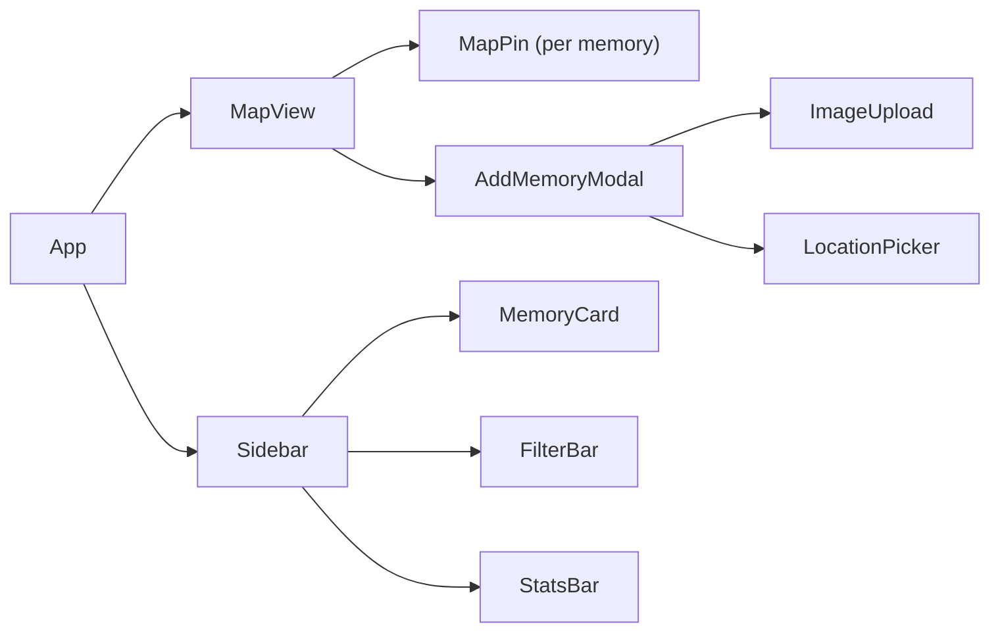

# 🌿 Green Spaces Memory Map — Project Plan

> DEV Weekend Challenge: Earth Day Edition | Due: April 20, 2026

---

## Concept

A community-driven map where people pin their favorite natural spaces — trails, summits, parks, riversides — and attach a photo + short story. A living love letter to the planet, built by the people who actually go outside.

**Tagline**: *"Map the places that made you love the planet."*

---

## Why This Wins

- **Emotionally resonant** — Earth Day isn't just about data, it's about connection
- **Visually impressive** — a populated map looks stunning in a demo
- **Authentically yours** — you can seed it with real spots from your hikes/runs
- **Technically interesting** — map rendering, image upload, persistent storage

---

## Tech Stack

| Layer | Choice | Why |
|-------|--------|-----|
| Frontend | React (Vite) | Your primary stack |
| Map | [Leaflet.js](https://leafletjs.com/) + React-Leaflet | Free, open-source, beautiful |
| Tile Layer | [Stamen Terrain](http://maps.stamen.com/) or OpenStreetMap | Free, earthy aesthetic |
| Storage | Artifact persistent storage (`window.storage`) | No backend needed for MVP |
| Image handling | Base64 or URL input | Keeps it simple |
| Styling | Tailwind CSS | Fast to build |
| Prize category | **GitHub Copilot** — feature it in the write-up as your pair programmer |

### Optional Upgrade (if time allows)
- **Google Gemini** — AI-generated "nature fact" or eco-tip based on the location's biome
- This would qualify for a second prize category 🎯

---

## Core Features (MVP)

### Must Have
- [ ] Interactive world map with custom green markers
- [ ] Click anywhere on map → "Add Memory" modal
- [ ] Memory form: name, location label, date visited, story (text), photo URL or upload
- [ ] Pins populate on map; click pin → view memory card
- [ ] Memories persist via `window.storage`
- [ ] Seed data: 5–10 real spots from your own adventures

### Nice to Have
- [ ] Filter by type: Trail / Summit / Park / Beach / Urban Green Space
- [ ] "Random memory" button — surprise me with someone's green space
- [ ] Simple stats: total pins, countries represented
- [ ] Gemini AI: generates a nature blurb for the pinned biome/region

---

## Component Architecture



---

## Data Model

```javascript
// Memory object
{
  id: "uuid",
  title: "string",           // "Ridge line at dusk"
  location: "string",        // "Banff National Park, AB"
  lat: number,
  lng: number,
  date: "YYYY-MM-DD",
  story: "string",           // short paragraph
  imageUrl: "string",        // URL or base64
  type: "trail" | "summit" | "park" | "beach" | "urban",
  author: "string"           // optional display name
}
```

---

## Build Schedule (Weekend Sprint)

### Friday Night (~2h)
- [ ] Scaffold React + Vite project
- [ ] Install React-Leaflet, Tailwind
- [ ] Get map rendering with basic marker
- [ ] Define data model + storage helpers

### Saturday Morning (~3h)
- [ ] Add Memory modal (form)
- [ ] Click-to-pin on map
- [ ] Save/load from `window.storage`
- [ ] Memory popup on pin click

### Saturday Afternoon (~2h)
- [ ] Memory card sidebar
- [ ] Seed with 5–10 real locations (your trails, parks, hikes)
- [ ] Styling pass — earthy, natural aesthetic

### Sunday (~2h)
- [ ] Polish + bug fixes
- [ ] Optional: Gemini integration
- [ ] Record demo (Loom or GIF)
- [ ] Write DEV.to post

---

## Seed Data Ideas (From Your Life)

Use real places you've been — this makes the write-up authentic:

| Place | Type | Your connection |
|-------|------|-----------------|
| A trail from a marathon route | Trail | "The stretch at mile 18 where I always find my second wind" |
| A summit from a backpacking trip | Summit | "Took 2 days to get here. Worth every blister." |
| A local park | Urban | "Where I do my recovery runs on Sundays" |
| A hockey rink surrounded by nature | Urban | "Outdoor rink in January — you know the one" |

The personal stories are what make this stand out from a generic map app.

---

## DEV.to Post Outline

```
Title: I Built a Green Spaces Memory Map for Earth Day 🌿

## What I Built
Community map for pinning + sharing favorite natural spaces.
Personal motivation: I'm a marathon runner and backpacker — these places matter to me.

## Demo
[Embedded app or Loom video]

## Code
[GitHub repo embed]

## How I Built It
- React + React-Leaflet for the map
- Persistent storage for memories across sessions
- Seed data from my own hikes and runs
- [If Gemini] Used Google Gemini to generate eco-context for each pinned region

## Prize Categories
- Best Use of GitHub Copilot
- [Optional] Best Use of Google Gemini
```

---

## Differentiators vs Other Submissions

Most Earth Day apps will be:
- Carbon calculators
- Data dashboards
- "Plant a tree" buttons

Yours will be:
- **Emotional and personal** — stories, not stats
- **Community-driven** — feels alive with seed data
- **Visually stunning** — a beautiful map beats a chart every time
- **Authentic** — written by someone who *actually* goes outside

---

## Quick Links

- [React-Leaflet docs](https://react-leaflet.js.org/)
- [Leaflet marker customization](https://leafletjs.com/reference.html#icon)
- [Stamen terrain tiles](http://maps.stamen.com/terrain/)
- [DEV submission template](https://dev.to/new?prefill=---%0Atitle%3A%20%0Apublished%3A%20...)
- [Challenge page](https://dev.to/challenges/weekend-2026-04-16)
