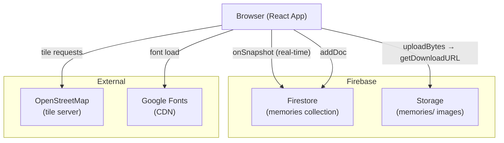
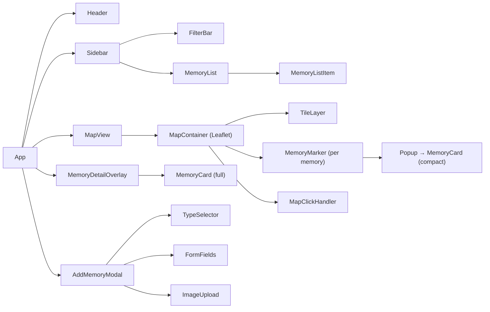
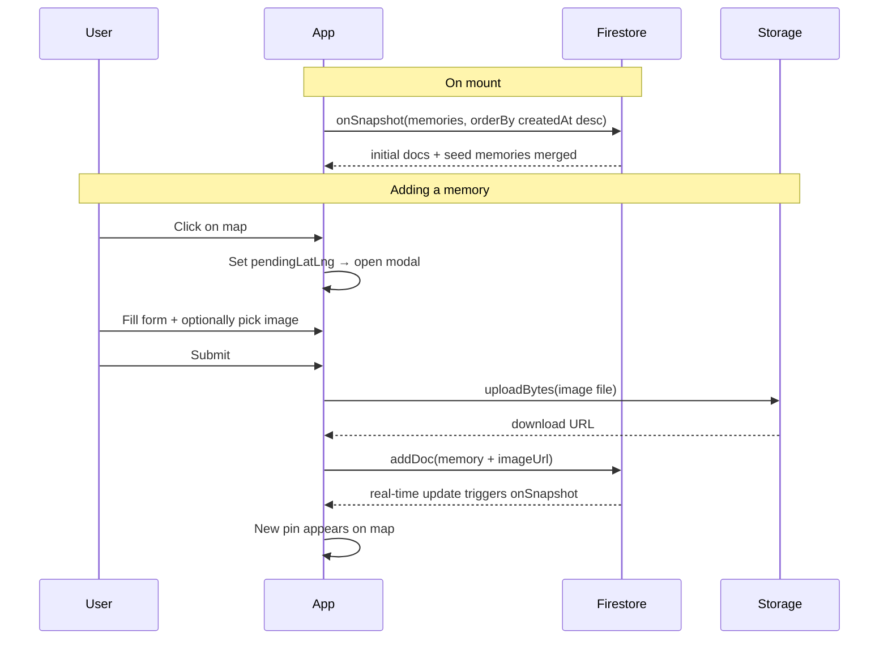

# Green Spaces Memory Map — Technical Architecture

---

## Tech Stack

| Layer | Choice | Rationale |
|-------|--------|-----------|
| Framework | React 18 + Vite | Your primary stack; Vite is fast to scaffold |
| Map | React-Leaflet + Leaflet.js | Free, open-source, no API key required |
| Map Tiles | OpenStreetMap (standard) | Free, no key, good terrain detail |
| Database | Firebase Firestore | Real-time sync out of the box, free tier generous |
| File Storage | Firebase Storage | Pairs naturally with Firestore, handles image uploads |
| Auth | None (MVP) | Lower barrier to contribute; better for demo |
| Styling | Vanilla CSS (CSS variables) | No build complexity; full control over earthy aesthetic |
| Fonts | Google Fonts (Playfair Display + Lora) | Organic editorial feel |
| Hosting | Firebase Hosting or Vercel | Both deploy from `dist/` in one command |
| IDs | `uuid` (npm) | Generate stable IDs for seed data |

---

## System Architecture



---

## Component Tree



---

## Data Flow



---

## File Structure

```
green-spaces/
├── index.html
├── vite.config.ts
├── package.json
├── firestore.rules
├── storage.rules
├── README.md
└── src/
    ├── main.tsx              # React root
    ├── App.tsx               # Root component, state orchestration
    ├── index.css             # Global styles + CSS variables
    ├── lib/
    │   ├── firebase.ts       # Firebase init (config placeholder)
    │   └── memories.ts       # Firestore/Storage helpers + seed data
    └── hooks/
    │   └── useMemories.ts    # Real-time subscription hook
    └── components/
        ├── Sidebar.tsx       # Filter + memory list
        ├── MemoryCard.tsx    # Card UI (compact + full variants)
        └── AddMemoryModal.tsx # Add pin form with image upload
```

---

## State Management

All state lives in `App.tsx` — no external state library needed at this scale.

| State | Type | Purpose |
|-------|------|---------|
| `memories` | `Memory[]` | Live Firestore docs merged with seed data |
| `pendingLatLng` | `{lat, lng} \| null` | Coordinates from map click; triggers modal |
| `selectedMemory` | `Memory \| null` | Opens detail overlay |
| `activeFilter` | `string` | Currently active place-type filter |

---

## Firebase Setup Checklist

- [ ] Create Firebase project (no Analytics needed)
- [ ] Add Web App → copy config → paste into `src/lib/firebase.ts`
- [ ] Enable Firestore → test mode → paste `firestore.rules`
- [ ] Enable Storage → test mode → paste `storage.rules`
- [ ] (Optional) Enable Firebase Hosting for deploy

---

## Custom Map Pins

Pins are inline SVG rendered via `L.divIcon` — no external image assets needed. Each type gets:

- A teardrop path shape with a drop shadow filter
- A white circle inset
- An emoji centred inside
- Type-specific fill colour (see PRD colour table)

This approach means zero HTTP requests for marker images and full colour control.

---

## Real-time + Seed Data Strategy

`useMemories` subscribes to Firestore via `onSnapshot` and sets state directly from live docs.

Seed data is added manually to Firestore after the app is built and deployed — not bundled in the client. This keeps the data layer simple and the client code free of hardcoded fixture data.

---

## Deployment

### Firebase Hosting (recommended — keeps everything in one project)
```bash
npm run build
firebase init hosting   # public: dist, SPA rewrite: yes
firebase deploy
```

### Vercel (fastest for a first deploy)
```bash
npm run build
vercel --prod
```

Both serve the same static `dist/` output. No server needed.

---

## Performance Notes

- Leaflet tiles are cached by the browser after first load
- Firestore `onSnapshot` keeps a persistent WebSocket — no polling
- Images are served directly from Firebase Storage CDN
- No code splitting needed at this project size
